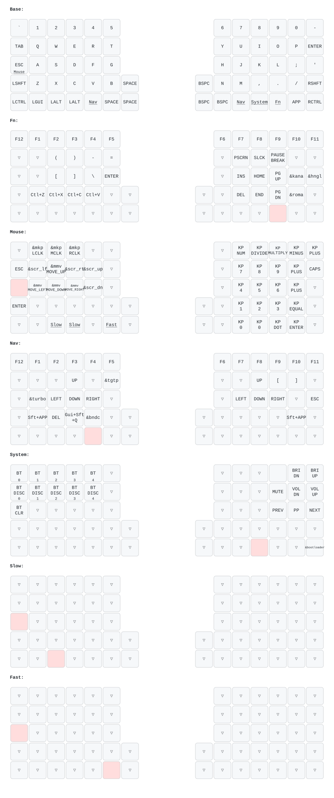

# zmk-for-felix-new

ZMK config for the FelixKeeb (5x12+4 split ortholinear) with nice!nano v2 and a 128x32 OLED.
The keymap is ported from the Preonic QMK keymap (`qmk_userspace/keyboards/preonic/keymaps/eg`).

## Build

GitHub Actions builds the matrix in [build.yaml](build.yaml) on ZMK v0.3.0:

| Artifact | Notes |
| --- | --- |
| `felix_left nice_oled` | Central. ZMK Studio (USB) and peripheral battery fetching are enabled here |
| `felix_right nice_oled` | Peripheral |
| `settings_reset` | Flash to both halves to clear pairing/settings |

### Local build

[build.sh](build.sh) runs [build.py](build.py) inside the `zmkfirmware/zmk-build-arm:stable` Docker image (only Docker is required). It reads the targets from [build.yaml](build.yaml) the same way CI does, and names the output files after the CI artifacts (e.g. `firmware/felix_left-nice_oled-nice_nano_v2-zmk.uf2`):

```sh
./build.sh              # all targets in build.yaml → firmware/*.uf2
./build.sh left reset   # only targets whose name contains "left" or "reset"
./build.sh -p left      # pristine build
./build.sh --update     # re-run west update
```

The first run fetches ZMK/Zephyr into `.west-build/` and takes a few minutes. Editing `config/west.yml` triggers `west update` automatically.

## Keymap


Source: [config/felix.keymap](config/felix.keymap). Layout JSON for keymap-drawer: [config/felix.json](config/felix.json).

| Layer | Contents |
| --- | --- |
| 0 Base | QWERTY. The 4 Felix-only center keys are Space (left) and Bksp (right) |
| 1 Fn | F keys, brackets, Ins/Home/PgUp/Del/End/PgDn, Ctrl+Z/X/C/V, IME keys (KANA/ROMA/HNGL) |
| 2 Mouse | Mouse move/scroll/buttons on the left, numpad on the right. Slow / Fast keys = QMK MS_ACL0 / MS_ACL2 |
| 3 Nav | Arrows, F keys, TURBO, Shift+App, ShareX (Shift+Win+Q), Bandicam (Ctrl+Shift+Alt+S), always-on-top (Ctrl+Win+T) |
| 4 System | Bluetooth profiles 0-4 (select / disconnect / clear), media, brightness, bootloader |
| 5 Slow / 6 Fast | Empty layers. While held, they scale mouse movement and scrolling down / up |

### TURBO (mouse turbo click)

A custom behavior in this repo ([src/behaviors/behavior_turbo_click.c](src/behaviors/behavior_turbo_click.c)),
ported from getreuer's QMK Mouse Turbo Click:

- Hold: left click repeats every 80ms (about 12 clicks/s).
- Double tap: locks, so clicking continues after release. Press again to stop.

Tune `period-ms` / `tap-ms` / `lock-tap-ms` on the `turbo` node in the keymap.

### Mouse speed

`ZMK_POINTING_DEFAULT_MOVE_VAL` and `&mmv { time-to-max-speed-ms }` at the top of the keymap approximate
the QMK settings (MOVE_DELTA 1 / MAX_SPEED 30 / TIME_TO_MAX 40). Adjust them on the real board.

## Repository layout

- `boards/shields/felix/` - Felix shield definition (matrix, physical layout, OLED)
- `config/` - keymap, conf, west manifest
- `dts/`, `src/`, `CMakeLists.txt`, `Kconfig`, `zephyr/module.yml` - custom behaviors (TURBO), loaded as a Zephyr module
